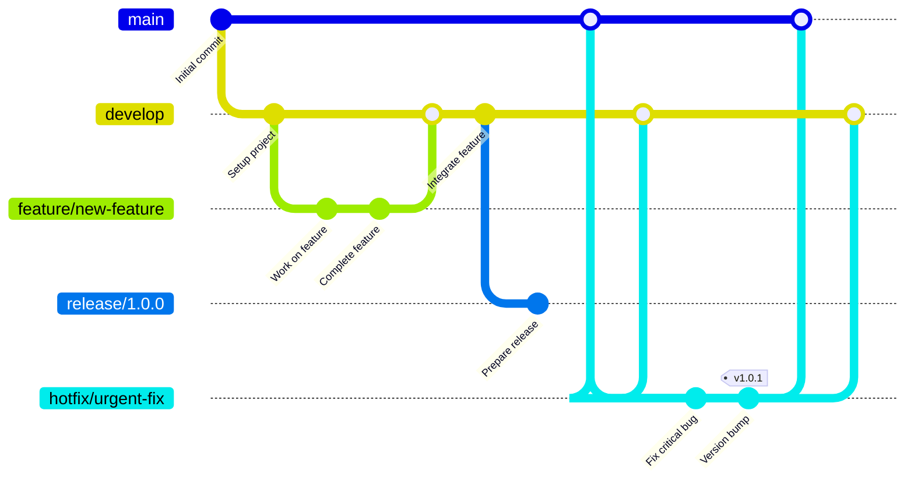
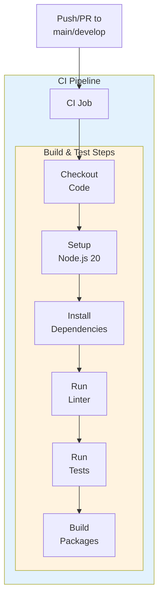

# Mermaid Diagram Examples

This document shows Mermaid equivalents of our Python-generated diagrams. These can be embedded directly in GitHub README files and will render automatically.

## Automated Release Workflow (Mermaid Version)

```mermaid
flowchart LR
    subgraph feature["feature/* Branch"]
        A[git flow<br/>feature start]
        B[Write Code]
        C[git cz<br/>conventional<br/>commits]
        D[Push &<br/>Create PR]
    end
    
    subgraph develop["develop Branch"]
        E[CI Tests]
        F[Merge<br/>Feature]
        G[Ready for<br/>Release]
    end
    
    subgraph release["release/* Branch"]
        H[git flow<br/>release start]
        I[cz bump<br/>auto version]
        J[Update<br/>CHANGELOG<br/>& versions]
        K[Commit &<br/>Tag v*.*.*]
    end
    
    subgraph main["main Branch"]
        L[git flow<br/>release finish]
        M[Push Tag]
        N[Release<br/>Workflow]
        O[GitHub<br/>Release]
    end
    
    subgraph back["Back to develop"]
        P[Auto-merge<br/>to develop]
        Q[Release<br/>Complete]
    end
    
    A --> B --> C --> D
    D --> E --> F --> G
    G --> H --> I --> J --> K
    K --> L --> M --> N --> O
    O --> P --> Q
    
    style feature fill:#e1f5ff
    style develop fill:#d4edda
    style release fill:#fff3cd
    style main fill:#f8d7da
    style back fill:#d1ecf1
```



## Git Flow Branching (Mermaid Version)



## CI Workflow (Mermaid Version)



## Package Release Workflow (Mermaid Version)

```mermaid
flowchart TB
    subgraph triggers["Package Release Triggers"]
        Python[package-a,b,c<br/>@v*.*.*]
        Rust[package-e,i<br/>@v*.*.*]
        Go[package-g<br/>@v*.*.*]
        Cpp[package-d<br/>@v*.*.*]
        Java[package-h<br/>@v*.*.*]
        Swift[package-f<br/>@v*.*.*]
    end
    
    subgraph workflows["Reusable Workflows"]
        PythonWF[Python Package<br/>Release]
        RustWF[Rust Package<br/>Release]
        GoWF[Go Package<br/>Release]
        CppWF[C++ Package<br/>Release]
        JavaWF[Java Package<br/>Release]
        SwiftWF[Swift Package<br/>Release]
    end
    
    Release[GitHub<br/>Release]
    
    Python --> PythonWF --> Release
    Rust --> RustWF --> Release
    Go --> GoWF --> Release
    Cpp --> CppWF --> Release
    Java --> JavaWF --> Release
    Swift --> SwiftWF --> Release
    
    style triggers fill:#e8f5e9
    style workflows fill:#fff3e0
```

## Comparison: Python Diagrams vs Mermaid

| Aspect | Python + Diagrams Library | Mermaid |
|--------|--------------------------|---------|
| **Icons** | ✅ GitHub, CI/CD, language icons | ❌ Text only |
| **Styling** | ✅ Full control | ⚠️ Limited |
| **GitHub Preview** | ❌ Must view image files | ✅ Renders inline in markdown |
| **Editing** | ❌ Requires running script | ✅ Edit directly in markdown |
| **Installation** | ❌ Python + Graphviz required | ✅ No installation (GitHub renders) |
| **Output Formats** | ✅ PNG, SVG | ✅ SVG, PNG (with mermaid-cli) |
| **Complexity** | ⚠️ Medium (Python code) | ✅ Simple (declarative syntax) |
| **PR Reviews** | ❌ Image diffs hard to review | ✅ Text-based, easy to review |
| **Automation** | ✅ Easy to batch generate | ⚠️ Manual per diagram |
| **Professional Look** | ✅ High quality with icons | ⚠️ Basic appearance |

## Recommendation

Use **both approaches**:

1. **Python + Diagrams** for:
   - High-quality diagrams with icons for documentation
   - Professional presentations and external materials
   - Generated artifacts in releases

2. **Mermaid** for:
   - Quick reference in README files
   - Living documentation that changes frequently
   - Easy collaboration and PR reviews
   - Inline rendering in GitHub

## Converting Python Diagrams to Mermaid

To convert our existing diagrams to Mermaid:

1. Identify the flow and clusters from the Python code
2. Create Mermaid flowchart with subgraphs for clusters
3. Define nodes and connections
4. Add styling for visual distinction
5. Embed in markdown files

## Rendering Mermaid Diagrams

**In GitHub/GitLab:**
- Automatically rendered in markdown files
- No special syntax needed

**In VS Code:**
- Install "Markdown Preview Mermaid Support" extension
- Preview renders diagrams automatically

**Generate Images:**
```bash
npm install -g @mermaid-js/mermaid-cli
mmdc -i diagram.md -o diagram.png
mmdc -i diagram.md -o diagram.svg
```
